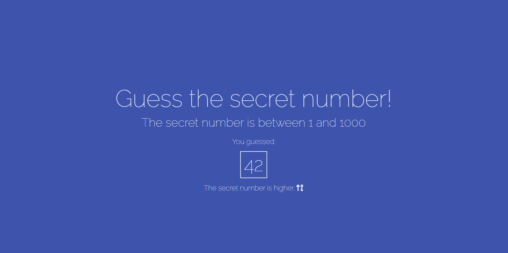
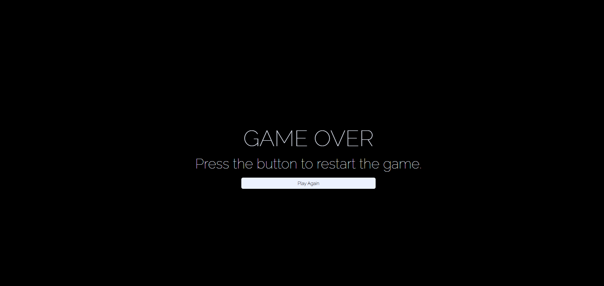

# Guess the Number

Projeto "Guess the Number" desenvolvido em HTML, CSS e JavaScript. 

## Screenshots

## Ferramentas Utilizadas

- HTML
- CSS
- JavaScript
- SpeechRecognition

## Funcionalidades
- Reconhecimento da língua portuguesa (pt-br);
- Retorna resultados inválidos para palavras e números que excedem o mínimo e máximo;
- Botão de reiniciar o jogo;
- Reconhece o comando "Game Over" para mudar de tela.

## Feito por:

Lucas Kenji
